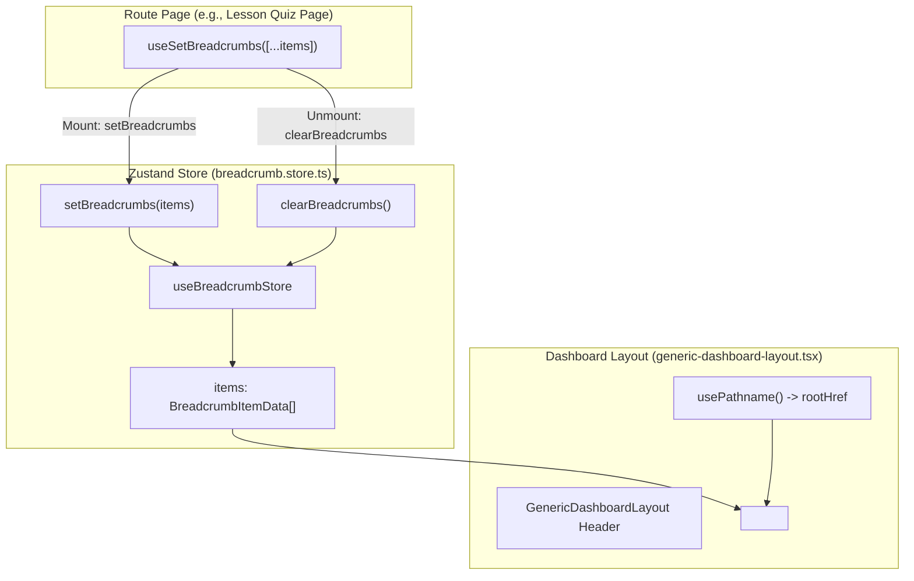
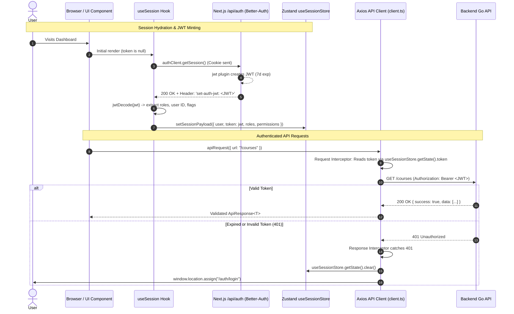

# Frontend Architecture: Breadcrumb Management & Web API JWT Interceptor

This document details the architectural design, implementation, and end-to-end lifecycle of:
1. **Frontend Breadcrumb Management** (Zustand store, custom hook, and dynamic layout component).
2. **Web API JWT Interceptor & Session Refresh** (Axios client interceptors, Zustand session store, Better-Auth integration, and token minting/expiration lifecycle).

---

## Part 1: Breadcrumb Management in the Frontend

Breadcrumb management in CourseHunt is designed to be **decoupled, declarative, and reactive**. Deeply nested route components (such as course chapters, lessons, quizzes, discussions, and feedback pages) can define their breadcrumb trails dynamically without needing to pass props through multiple layout levels.

### 1.1 Architecture Overview

The system consists of three core layers:



---

### 1.2 Core Components & Implementation

#### 1. Zustand Store: [`apps/web/src/store/breadcrumb.store.ts`](file:///home/rahulcodepython/Workspace/CourseHunt/apps/web/src/store/breadcrumb.store.ts)
A lightweight client-side store holds the active breadcrumb array in memory:

```typescript
export interface BreadcrumbItemData {
  label: string;
  href?: string;
}

interface BreadcrumbState {
  items: BreadcrumbItemData[];
  setBreadcrumbs: (items: BreadcrumbItemData[]) => void;
  clearBreadcrumbs: () => void;
}

export const useBreadcrumbStore = create<BreadcrumbState>((set) => ({
  items: [],
  setBreadcrumbs: (items) => set({ items }),
  clearBreadcrumbs: () => set({ items: [] }),
}));
```

#### 2. Declarative React Hook: [`apps/web/src/hooks/use-breadcrumb.ts`](file:///home/rahulcodepython/Workspace/CourseHunt/apps/web/src/hooks/use-breadcrumb.ts)
A custom hook encapsulates registration and automatic cleanup:

```typescript
export function useSetBreadcrumbs(items: BreadcrumbItemData[]) {
  const setBreadcrumbs = useBreadcrumbStore((s) => s.setBreadcrumbs);
  const clearBreadcrumbs = useBreadcrumbStore((s) => s.clearBreadcrumbs);

  // Serialized comparison prevents infinite render loops when object literals are passed
  const serialized = useMemo(() => JSON.stringify(items), [items]);

  useEffect(() => {
    setBreadcrumbs(items);
    return () => {
      clearBreadcrumbs(); // Clean up state when navigating away
    };
  }, [serialized, setBreadcrumbs, clearBreadcrumbs]);
}
```

**Key Advantages**:
- **Automatic Cleanup**: When a user navigates away or unmounts the page, the return cleanup function resets breadcrumbs.
- **Reference Stability**: `JSON.stringify(items)` ensures that passing inline arrays like `useSetBreadcrumbs([{ label: "Users", href: "/users" }, ...])` does not trigger redundant effect runs on re-renders.

#### 3. Render Component: [`apps/web/src/components/breadcrumb-component.tsx`](file:///home/rahulcodepython/Workspace/CourseHunt/apps/web/src/components/breadcrumb-component.tsx)
Mounted globally within [`GenericDashboardLayout`](file:///home/rahulcodepython/Workspace/CourseHunt/apps/web/src/components/generic-dashboard-layout.tsx):

- **Root Breadcrumb Resolution**: Inspects `usePathname()` to dynamically anchor the root crumb to either `/tutor/dashboard`, `/student/dashboard`, or `/admin/dashboard`.
- **Dynamic Hierarchy**:
  - If `items` is empty, displays a non-clickable `Dashboard` page.
  - If `items` exists, displays a clickable link to `Dashboard`, followed by each item in sequence separated by `<BreadcrumbSeparator />`.
  - The **final item** or any item without an `href` is rendered as active text (`<BreadcrumbPage>`) with responsive truncation (`max-w-37.5 truncate sm:max-w-75`).
  - Intermediate items with `href` are rendered as Next.js `<Link>` elements wrapped in `<BreadcrumbLink asChild>`.

---

### 1.3 Usage in Pages

Deeply nested pages simply declare their breadcrumb trail on render:

```tsx
// Example: apps/web/src/app/tutor/courses/[courseId]/chapters/[chapterId]/lessons/[lessonId]/quiz/page.tsx
useSetBreadcrumbs([
  { label: "Courses", href: "/tutor/courses" },
  { label: course?.title ?? "Course", href: `/tutor/courses/${courseId}` },
  { label: "Chapters", href: `/tutor/courses/${courseId}/chapters` },
  { label: chapter?.title ?? "Chapter", href: `/tutor/courses/${courseId}/chapters/${chapterId}/lessons` },
  { label: lesson?.title ?? "Lesson", href: `/tutor/courses/${courseId}/chapters/${chapterId}/lessons/${lessonId}` },
  { label: "Quiz" },
]);
```

---

## Part 2: JWT Token Lifecycle & Web API Axios Interceptors

CourseHunt uses a hybrid authentication setup:
- **Frontend / Next.js Auth**: Managed via [Better-Auth](https://better-auth.com) with httpOnly session cookies.
- **Backend API (Go Microservices)**: Stateless REST API requiring standard `Authorization: Bearer <JWT>` headers.

The frontend acts as a bridge: it retrieves a minted JWT from the Next.js Better-Auth layer, stores it in Zustand memory, and injects it into every outgoing Axios request.

### 2.1 Complete Authentication & Request Flow



---

### 2.2 Core Modules & Implementation

#### 1. Axios Instance & Interceptors: [`apps/web/src/react-query/client.ts`](file:///home/rahulcodepython/Workspace/CourseHunt/apps/web/src/react-query/client.ts)

Axios is configured as the singleton HTTP client for backend queries:

```typescript
const api: AxiosInstance = axios.create({
  baseURL: process.env.NEXT_PUBLIC_API_URL ?? API_CONFIG.DEFAULT_URL,
  withCredentials: true,
});
```

##### A. Request Interceptor (JWT Injection)
Runs outside the React component tree before each outbound request:
```typescript
api.interceptors.request.use((config) => {
  // Reads token directly from Zustand outside React using getState()
  const token = useSessionStore.getState().token;
  if (token) {
    config.headers.Authorization = `Bearer ${token}`;
  }
  return config;
});
```
- **Direct Store Access**: By calling `useSessionStore.getState().token`, Axios doesn't need to be wrapped inside React hooks or context providers.

##### B. Response Interceptor (401 Expiration & Redirect)
Handles unauthorized responses:
```typescript
api.interceptors.response.use(
  (response) => response,
  (error) => {
    if (axios.isAxiosError(error) && error.response?.status === 401) {
      // Clear client session cache
      useSessionStore.getState().clear();

      // Redirect user to login page if not already there
      if (typeof window !== "undefined" && !window.location.pathname.startsWith("/auth/login")) {
        window.location.assign("/auth/login");
      }
    }
    return Promise.reject(error);
  },
);
```

---

#### 2. Session Store: [`apps/web/src/store/session.store.ts`](file:///home/rahulcodepython/Workspace/CourseHunt/apps/web/src/store/session.store.ts)

Maintains the user session and token in-memory:
- `token: string | null`: Contains the active signed JWT Bearer string.
- `roles: string[]`: Extracted from the JWT claims.
- `permissions: string[]`: Loaded from the session payload.
- `clear()`: Wipes user, session, roles, permissions, and token.

---

#### 3. Session Synchronization & JWT Minting: [`apps/web/src/hooks/use-session.ts`](file:///home/rahulcodepython/Workspace/CourseHunt/apps/web/src/hooks/use-session.ts)

When the frontend loads or session refresh is called:

1. `authClient.getSession(...)` requests the current session from Better-Auth.
2. The server responds with the `set-auth-jwt` response header containing the newly minted JWT.
3. `useSession` captures this header via the `onResponse` callback:
   ```typescript
   async function fetchSession(): Promise<SessionPayload> {
     try {
       let jwt: string | null = null;
       const { data, error } = await authClient.getSession({
         fetchOptions: {
           onResponse: (ctx) => {
             jwt = ctx.response.headers.get("set-auth-jwt");
           },
         },
       });

       if (error || !data?.user) return EMPTY_SESSION;

       return buildSessionPayload({
         user: data.user,
         session: data.session,
         jwtToken: jwt,
       });
     } catch {
       return EMPTY_SESSION;
     }
   }
   ```
4. `buildSessionPayload` decodes the JWT using `jwtDecode`, extracts user roles, permissions, and `must_change_password`, and writes them to the Zustand store via `setSessionPayload()`.
5. On app hydration:
   ```typescript
   useEffect(() => {
     if (hydratedRef.current) return;
     hydratedRef.current = true;

     if (!token) {
       refreshSession();
     }
   }, [token, refreshSession]);
   ```

---

#### 4. JWT Minting Configuration on the Server: [`apps/web/src/lib/auth.ts`](file:///home/rahulcodepython/Workspace/CourseHunt/apps/web/src/lib/auth.ts)

Better-Auth server plugin configures JWT generation:
- **Expiration**: 7 days (`expirationTime: "7d"`).
- **Payload**: Contains `sub`, `user_id`, `role`, `roles`, `banned`, and `must_change_password`.
- **Optimization Note**: The `permissions` array is intentionally omitted from the JWT payload to prevent header bloat that could exceed fasthttp buffer limits on the Go backend. Permissions are delivered separately via `customSession` on the session response.

---

## Part 3: Summary of Key Files

| Feature | Key File | Role |
| :--- | :--- | :--- |
| **Breadcrumbs** | [`apps/web/src/store/breadcrumb.store.ts`](file:///home/rahulcodepython/Workspace/CourseHunt/apps/web/src/store/breadcrumb.store.ts) | Zustand store for active breadcrumb items |
| | [`apps/web/src/hooks/use-breadcrumb.ts`](file:///home/rahulcodepython/Workspace/CourseHunt/apps/web/src/hooks/use-breadcrumb.ts) | Hook with auto-mount/unmount cleanup |
| | [`apps/web/src/components/breadcrumb-component.tsx`](file:///home/rahulcodepython/Workspace/CourseHunt/apps/web/src/components/breadcrumb-component.tsx) | Renders breadcrumbs in the layout header |
| **JWT & Interceptor** | [`apps/web/src/react-query/client.ts`](file:///home/rahulcodepython/Workspace/CourseHunt/apps/web/src/react-query/client.ts) | Axios client with request (JWT attach) & response (401 handler) interceptors |
| | [`apps/web/src/store/session.store.ts`](file:///home/rahulcodepython/Workspace/CourseHunt/apps/web/src/store/session.store.ts) | Holds `token`, `user`, `roles`, and `permissions` |
| | [`apps/web/src/hooks/use-session.ts`](file:///home/rahulcodepython/Workspace/CourseHunt/apps/web/src/hooks/use-session.ts) | Hydrates session, captures `set-auth-jwt` header, decodes claims |
| | [`apps/web/src/lib/auth.ts`](file:///home/rahulcodepython/Workspace/CourseHunt/apps/web/src/lib/auth.ts) | Better-Auth server config issuing JWT via `jwt()` plugin |
